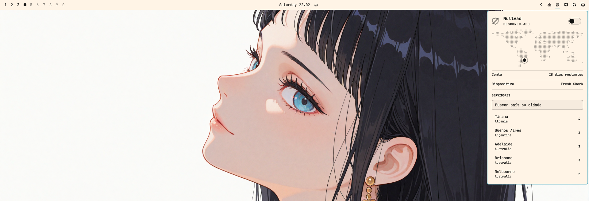
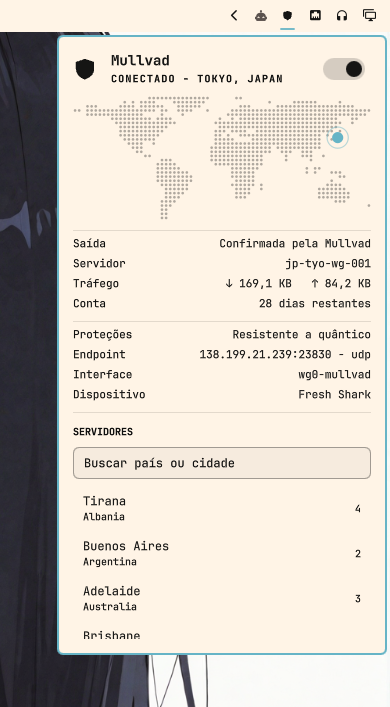
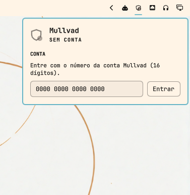

# Omaguard

🛡️ Mullvad VPN widget for the [Omarchy](https://omarchy.org) Quattro bar — real
tunnel state, one-click connect, and server switching.

Omaguard is a native Quickshell plugin for Omarchy 4's bar. It reads tunnel state
from `mullvad-daemon` as a **push stream**, not a polling loop, so a
`mullvad disconnect` typed in another terminal shows up in under a second. It
never asks for a password, never needs root, and answers the question a status
dot cannot: *is my traffic actually leaving through the tunnel?*



## Features

- **Live tunnel state.** The daemon pushes one JSON event per change; a backoff
  supervisor reconnects the stream when the daemon restarts, and a periodic
  reconciliation corrects drift if it ever dies silently.
- **Real exit verification.** The panel distinguishes *connected and confirmed*
  from *connected but leaking* from *cannot tell yet* — an interface being up
  does not prove traffic flows through it.
- **One-click connect,** with an optimistic toggle that reacts before the daemon
  confirms. No password prompt, ever: the Mullvad CLI talks to its daemon over a
  socket.
- **Server switching with search** across 91 cities, each showing how many relays
  it has. Selecting one sets the constraint and brings the tunnel up in the right
  order.
- **Account login in the panel.** The account number travels over stdin, is
  cleared the instant the daemon receives it, and is never logged, displayed, or
  written to disk.
- **A world map** marking where your traffic surfaces, drawn as a dot grid in
  your theme's colours. Rendered from a grid generated offline — nothing is
  fetched at runtime.
- **Details while connected:** active protections (quantum resistance, DAITA,
  multihop), endpoint and protocol, tunnel interface, and bytes transferred.
- **Degrades honestly.** With no CLI, no daemon, or no account, it says which one
  is missing and how to fix it — and the icon never claims "disconnected" for a
  state it cannot observe.
- **Speaks your language.** English by default, Brazilian Portuguese when the
  system asks for it, and adding a language means adding one file.

## Reference guides

- [Architecture](docs/architecture.md) — state flow, update layers, credential
  handling, process discipline
- [Decisions](docs/decisions.md) — why the Mullvad CLI over plain WireGuard, why
  a stream over polling, what was left out
- [Mullvad CLI surface](docs/mullvad-cli.md) — verified command output with real
  samples, the source of truth for the parser
- [Development](docs/development.md) — dev cycle, validation, Quickshell traps,
  manual verification script

## Requirements

- Omarchy 4.x (Quattro), where the bar is a Quickshell plugin
- `mullvad-vpn-daemon` — the CLI and daemon, without the Electron app

```bash
sudo pacman -S mullvad-vpn-daemon
sudo systemctl enable --now mullvad-daemon
```

No terminal login needed: the panel has a field for the account number.

## Install

```bash
omarchy plugin add https://github.com/JustSpica/omaguard.git --enable
```

Omarchy clones the repository into `~/.config/omarchy/plugins/io.github.justspica.omaguard/`,
validates the manifest before trusting it, and — with `--enable` — asks which bar
section to place the widget in and writes the entry for you.

Drop `--enable` to install without touching the bar, then place it later:

```bash
omarchy plugin enable io.github.justspica.omaguard --section right
omarchy plugin disable io.github.justspica.omaguard
omarchy bar move io.github.justspica.omaguard --before omarchy.network
```

### Updating and removing

```bash
omarchy plugin update io.github.justspica.omaguard    # fetch, show the diff, re-validate
omarchy plugin remove io.github.justspica.omaguard    # uninstall
```

`update` only fast-forwards, re-validates the manifest afterwards, and rolls the
checkout back if the new revision fails validation — a broken push upstream
cannot leave you with a broken bar.

### What gets installed

The repository *is* the plugin folder: `manifest.json` sits at its root because
the clone lands directly in the plugins directory, with no subdirectory in
between. `docs/`, `test/`, and `screenshots/` come along and are never loaded.

Plugins run as unsandboxed code inside the long-lived `omarchy-shell` process,
which is why `omarchy plugin add` prints a warning and asks for confirmation.
Read the source before you enable anything — this one included.

## Usage

### The bar icon

The icon is a shield that reports four things at a glance — compare it across the
screenshots on this page: struck through above, filled below, badged further
down.

| Appearance | Meaning |
| --- | --- |
| Filled | tunnel up |
| Struck through | tunnel down |
| Outline, no mark | state unknown — still probing |
| Badge | needs you: no account, no daemon, no CLI, or traffic leaving outside the tunnel |

| Action | Effect |
| --- | --- |
| Left click | open the panel |
| Right click | connect or disconnect |
| Middle click | force a refresh |

### The panel



The map marks where your traffic surfaces, and the marker's colour carries the
meaning: **accent** for the relay the tunnel exits through, **plain** for your
own location while disconnected, and **urgent** when traffic is leaving outside
the tunnel.

Rows come in two groups — connection first, then technical detail — and appear as
they become knowable. State and location are absent on purpose: the hero above
already reads `CONECTADO · TOKYO, JAPAN`. The panel scrolls when the content
outgrows it.

**Saída** is the row worth understanding: it reads `Confirmada pela Mullvad` when
the daemon confirms the exit IP belongs to Mullvad, `Fora do túnel` when it does
not, and `Verificando` while a transition is in flight — never guessing a leak
from a missing field.

**Servidores** lists cities rather than individual relays: the daemon already
balances load within a city, and 91 entries stay navigable where 574 would not.
Type to filter by country or city; picking one sets the constraint and then
connects or reconnects, depending on the current state.

With the panel open and the tunnel up, **Tráfego** polls the interface counters
every 3 seconds. With the panel closed, that costs nothing.

| Key | Action |
| --- | --- |
| `c` | connect or disconnect |
| `Esc` | close the panel |
| Typing | filters the server list when the search field has focus |

### Signing in



With no account, the panel collapses to a single question. The number is masked
as you type, goes to the daemon over stdin, and is discarded the moment it is
sent. Everything else stays hidden until there is an account to act on — the
widget never offers a control it cannot honour.

### From the command line

```bash
omarchy-shell io.github.justspica.omaguard status
omarchy-shell io.github.justspica.omaguard toggleVpn
omarchy-shell io.github.justspica.omaguard connect
omarchy-shell io.github.justspica.omaguard disconnect
omarchy-shell io.github.justspica.omaguard refresh
```

Handy for Hyprland keybindings. `status` returns JSON:

```json
{"phase":"disconnected","location":"Canoas, Brazil","exitIsMullvad":false,"loggedIn":true,"daysLeft":28}
```

The action commands return `ok`, `busy`, or the reason they were refused
(`cliMissing`, `daemonDown`, `noAccount`, `checkingAccount`) — they never report
success for something that did not run.

## Languages

The widget follows the system locale, falling back to English:

| `LANG` | Panel language |
| --- | --- |
| `en_US.UTF-8`, or anything unrecognised | English |
| `pt_BR.UTF-8` | Brazilian Portuguese |

Tags are matched exactly, in `xx_YY` form. `pt` or `pt_PT` resolve to English
rather than to `pt_BR` — a near-miss language reads worse than no translation.
The locale is resolved once when the plugin loads, so a language change takes
effect on the next `omarchy restart shell`.

Adding a language is two steps:

1. Copy `locale/en_US.js` to `locale/<xx_YY>.js` and translate the values.
2. Register it in the `CATALOGS` map at the top of `I18n.js`.

`node --test 'test/*.test.js'` then fails if the new catalogue is missing any
key, or if a plural entry lacks its `one`/`other` forms. Missing keys fall back
to English silently at runtime, which is why the test exists.

## Configuration

Inline keys on the widget's `shell.json` entry:

| Key | Default | What it does |
| --- | --- | --- |
| `reconcileIntervalSec` | 30 | how often state is reconciled. Normal state arrives as daemon events; this only corrects drift if the stream dies silently. Accepts 10 to 3600 |

```json
{ "id": "io.github.justspica.omaguard", "reconcileIntervalSec": 60 }
```

## How it works

**State is pushed, not polled.** `mullvad status --json listen` emits one JSON
line per event for as long as the daemon lives. Three layers keep that honest: the
stream itself, a backoff supervisor that reconnects from 1 s to a 30 s cap, and a
reconciliation snapshot that corrects drift.

**The exit code is not an error channel.** The Mullvad CLI exits `0` even with no
account and no relay list, so output content is the only reliable signal. Every
parser returns one of three shapes — parse failure, no data, or valid data — and
that distinction is what keeps a gRPC error from being read as a logged-in
account.

**The account number is the only credential Mullvad has.** It is masked on
screen, sent over stdin rather than `argv` where any `ps` could read it, cleared
from memory right after the write, and never persisted. A test asserts that no
parsed field can carry it.

[`docs/architecture.md`](docs/architecture.md) covers all of this in depth.

## Development

```bash
git clone https://github.com/JustSpica/omaguard.git ~/.config/omarchy/plugins/io.github.justspica.omaguard
```

A cloned plugin is a real directory, so edits reload on save.

```bash
node --test 'test/*.test.js'                # parsing, against real fixtures
omarchy plugin validate .                   # manifest, from the repo root
journalctl --user -f | grep "io.github.justspica.omaguard"
```

Parsing lives in `Model.js` with no QML import, which is what makes it testable
outside a running shell — everything else needs eyes on the panel. See
[`docs/development.md`](docs/development.md) for the manual verification script
and the Quickshell traps worth knowing.

## Layout

```
manifest.json        id, kinds, entryPoints, and the settings schema
Panel.qml            bar icon, panel, login, details
Service.qml          event stream, backoff, reconciliation, actions
RelayPicker.qml      city search and list
WorldMap.qml         dot-matrix world map with the relay marker
MapData.js           the map grid, generated by tools/
TrafficCounters.qml  interface byte counters, read from sysfs
Model.js             pure parsing — no QML, testable in Node
MullvadIcon.qml      vector shield
I18n.js              translation lookup, plural forms, locale resolution
locale/              one catalogue per language (en_US, pt_BR)
test/                Model tests and real CLI fixtures
tools/               regenerates MapData.js from a borders GeoJSON
docs/                architecture, decisions, CLI surface, development
screenshots/         images used by this README
```

## Conventions

Documentation, code comments, test names, and commit messages in English;
Conventional Commits with scope (`feat(plugin):`, `docs:`). User-facing strings
live in `locale/`, never inline in the source.

The full rules for agents live in [`AGENTS.md`](AGENTS.md) — that is the
canonical file; do not duplicate rules in this README.

## License

MIT.
