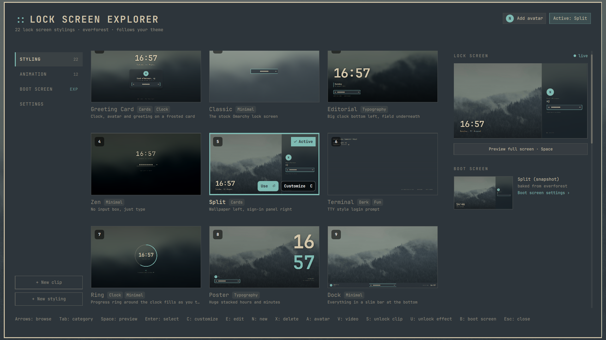

# Lock Screen Explorer

A few lock screen designs for Omarchy 4 and a picker to preview and switch between them.
Colors and fonts come from your Omarchy theme.



Designs: Greeting Card, Classic (the stock one), Editorial, Zen, Split, Terminal, Ring, Poster, Dock, Aurora, Analog, Flip, Island, Cinema, Sheet, Neon, Calendar, Frame, Dayline, Profile, Weather, Music, System, Rain.

Weather fetches from wttr.in (same location as the bar widget), Music reads MPRIS players, System shows uptime, memory, load and battery.

Every password field has an eye button to show what you typed (Ctrl+E does the same). It hides again after a failed attempt or when the field is cleared.

## Install

```sh
omarchy plugin add https://github.com/SirJul1337/omarchy-lock-explorer.git --enable
omarchy restart shell
```

The restart is needed: the shell loads this service before it unloads the stock one, so for a
moment both claim the `lock` IPC target and the stock one keeps it. Until you restart,
`omarchy-shell lock explore` answers `Function not found`.

This replaces the built-in `omarchy.lock` service (the manifest has `clonedFrom: omarchy.lock`
so the shell swaps them and everything that locks the screen keeps working). Disable or remove
the plugin to get the stock lock screen back.

## Usage

```sh
omarchy-shell lock explore
```

Arrows to browse, Tab to switch category (or click the chips), Space for full-size preview, Enter to select, Esc to close. Scroll with the mouse wheel or PageUp/PageDown. `U` cycles the unlock animation and `Shift+U` its length, the same as clicking the Unlock chip in the header.

`A` picks a profile picture with the normal file dialog (the explorer steps aside while the
dialog is up and comes back when you are done), `Shift+A` clears it again. The designs that show
the user — Greeting Card, Split, Dock, Poster, Sheet, Island and Profile — use it, and fall back
to your initial when there is none.

`C` on any design copies it to `~/.config/omarchy/lock-designs/` (it shows up under Custom) and opens it in the
built-in editor. `E` edits a custom design, `N` starts a new one from the template. `X` (or the
Delete button on the card) removes a design of your own — press it twice, the first press just
arms the button. Deleting a clip design also removes its video from `~/.config/omarchy/lock-videos/`
unless something else still uses it (another design, the boot screen, the Motion video or the
unlock clip). Built-in designs can't be deleted. The editor has the code on
the left and a live preview on the right: Ctrl+S saves and reloads the preview and the lock screen, Ctrl+O opens
the file in your normal editor (changes made there are picked up too), Esc goes back.

To get it in the app launcher and the Omarchy menu (Style -> Lock Screen):

```sh
~/.config/omarchy/plugins/io.github.sirjul1337.lock-explorer/extras/install.sh
```

Optional keybinding for `~/.config/hypr/bindings.lua`:

```lua
o.bind("SUPER + SHIFT + L", "Lock screen explorer", "omarchy-shell lock explore")
```

Other commands:

```sh
omarchy-shell lock designs
omarchy-shell lock design
omarchy-shell lock setDesign zen
omarchy-shell lock previewDesign split   # you can type in the preview
omarchy-shell lock previewFail           # show the failure state in the preview
omarchy-shell lock hidePreview
omarchy-shell lock monitors
omarchy-shell lock setInputMonitor DP-1  # or "all"
omarchy-shell lock avatar
omarchy-shell lock pickAvatar            # the file dialog, same as A in the explorer
omarchy-shell lock setAvatar ~/me.png
omarchy-shell lock clearAvatar           # back to the initial
omarchy-shell lock resetAvatar           # back to whatever is found automatically
omarchy-shell lock unlockAnimation
omarchy-shell lock setUnlockAnimation fade   # none (default), fade, zoom or rise
omarchy-shell lock setUnlockDuration 600     # milliseconds, 0-2000, 400 by default
omarchy-shell lock previewUnlock             # play it on an open preview
omarchy-shell lock boot
omarchy-shell lock setBoot follow            # stock, follow, or a design id with a twin
```

With more than one monitor you can pick which one shows the sign-in with `setInputMonitor`.
The others get a clock only screen (typing still works there).

The unlock is instant unless you ask for an animation. The Unlock chip in the explorer header
turns one on -- click it to cycle, click the milliseconds next to it for the length, or use `U`
and `Shift+U`. With one on, the lock screen animates away rather than blinking out: the design fades into the plain wallpaper and the desktop is behind it on the
same background. `fade` dissolves it, `zoom` fades with a slight push in and `rise` lifts it off
the screen, `none` is the default instant one. `setUnlockDuration` takes milliseconds.
`previewUnlock` plays the animation on the preview so you can see it without locking. The lock
screen is held for the duration of the animation, so keep it short.

Hyprland paints black under the lock screen, which is why the plain wallpaper is drawn behind the
fade: the desktop comes back on the same background instead of through a dark flash. With
`misc:session_lock_xray = true` the compositor keeps drawing the desktop under the lock screen
instead, and the fade goes straight into it.

The selected design, the avatar, the unlock animation and the boot screen setting are saved on
the plugin entry in `~/.config/omarchy/shell.json`.

With no avatar set, the first of `~/.config/omarchy/lock-avatar.{png,jpg,jpeg,webp}`, `~/.face`,
`~/.face.icon` and `/var/lib/AccountsService/icons/$USER` is used, so an existing profile picture
shows up on its own.

## Boot screen (drive decryption) — experimental

The boot screen support is experimental: it works and fails safe (a broken theme drops
Plymouth to its plain text prompt, and the boot itself is never touched), but it is younger
than the rest of the plugin.

The screen that asks for your disk passphrase at first boot is Plymouth, not the shell, so it
normally stays the stock Omarchy one no matter which design you pick. Designs with a boot twin
under `plymouth/` -- Terminal and Rain so far -- can style it too. Press `B` in the explorer (or
click the Boot screen chip) and pick "Match lock screen" to keep it in sync with your lock
design, pick a specific design to pin it, or "Untouched" to restore the stock one.

Applying generates a Plymouth theme from your current Omarchy theme colors and ships it as a
systemd-stub initrd addon on the EFI partition (`omarchy_linux.efi.extra.d/`), which the boot
stub layers over the boot image -- one small file write, near-instant, one password prompt, no
initramfs rebuild. The first apply after updating from an older version of this plugin also
cleans up the previously baked-in theme, which runs one last rebuild (~30s). Colors are baked
into the addon at apply time, so re-apply after switching Omarchy theme (the explorer offers
this automatically). If a generated theme ever misbehaves the boot itself is fine -- Plymouth
falls back to a plain text prompt -- "Untouched" deletes the addon and the stock screen is back.
Snapshot boot entries never see the addon, so rollbacks always show the stock theme. Systems
that don't boot Omarchy's UKI keep the old bake-and-rebuild path automatically.

The twins are honest ports, not screenshots: Terminal keeps the blinking cursor, the bullets and
a caps lock warning, Rain keeps the falling glyphs, animated live by plymouth. Clocks and live
data can't come along (Plymouth has no clock and boots before the network), which is why not
every design has a twin.

You can try a twin without touching your boot:

```sh
extras/boot-vm-test.sh "$(plymouth/apply.sh terminal --stage-only)"
```

boots your real kernel and initramfs in QEMU against a throwaway encrypted disk (passphrase:
`omarchy`). Needs `qemu-system-x86`, `edk2-ovmf` and `qemu-ui-gtk`.

## Your own designs

Easiest: open the explorer, pick a design you like and press `C`. That copies it to
`~/.config/omarchy/lock-designs/` and opens the editor. `N` gives you a blank one from
`extras/lock-designs/MyDesign.qml`. You can also just drop `.qml` files in that folder yourself;
they show up under Custom, named after the file (`My Design` for `MyDesign.qml`, id `my-mydesign`).

```sh
omarchy-shell lock customize zen        # copy the Zen design to ~/.config/omarchy/lock-designs/Zen.qml
omarchy-shell lock editDesign my-zen    # open it in your editor
omarchy-shell lock rescanDesigns        # pick up files added by hand
```

Keep the `import "../plugins/io.github.sirjul1337.lock-explorer/designs"` line, that is where
`DesignBase`, `PasswordField`, `LockInput`, `Wallpaper` and `Avatar` come from.

Your own video works as an unlock clip too: "+ New clip" in the explorer sidebar (or
`omarchy-shell lock newClipDesign`) opens the file picker, copies the video to
`~/.config/omarchy/lock-videos/` and writes a one-line design for it, which shows up under
Animation. Like Storm and the others, the first frame holds while locked and the video plays
through as the unlock — so a clip that ends on your wallpaper looks best. By hand it is just a
file in `~/.config/omarchy/lock-designs/` containing
`ClipDesign { clipName: "my-video.mp4" }` after the import line.

"Unlock video ends as your wallpaper" under Settings makes any clip end seamlessly: the clip's
last frame is extracted while the screen is locked and set as the session background
(`omarchy-theme-bg-set`) the moment the video hands the screen back, so the desktop opens exactly
where the video stopped. Switching theme or cycling backgrounds replaces it again like any other
wallpaper. Off by default; also from the command line:

```sh
omarchy-shell lock setClipWallpaper true
```

"Clip speed" next to it plays the unlock clips faster or slower (0.5x-2x, also
`omarchy-shell lock setClipSpeed 1.5`). It applies to the clip designs and the separate unlock
clip alike.

To add a design to the plugin itself, copy one of the files in `designs/`, add it to
`Designs.js`, run `omarchy restart shell`.

A design is a `DesignBase` item. It gets `passwordText`, `failureMessage`, `failedAttempts`,
`authenticatingPassword`, `fingerprintConfigured`, `inputEnabled`, a ticking `now`, `userName`,
`hostName` and `greeting()`. Use `PasswordField` for a normal input box or `LockInput` if you
want to draw the input yourself, and point `inputItem` at it so it gets focus. Set
`shakeOnFail: true` on box-less designs (the base flashes red on a wrong password either way), and
`showPasswordToggle: false` if you do not want the eye button.

For the profile picture use `Avatar { lock: lock; width: 96 }`, which shows the chosen image
masked to a circle and the user's initial when there is none. `fontSize`, `fillColor`,
`textColor`, `borderWidth`, `borderColor` and `shadow` are there to fit it into a design. The raw
values are on the base as `hasAvatar` and `avatarUrl` if you want to draw it yourself.

## Remove

```sh
omarchy plugin remove io.github.sirjul1337.lock-explorer
omarchy restart shell
```

That restores the built-in Omarchy lock screen. Your own designs in
`~/.config/omarchy/lock-designs/` are left alone, delete that folder if you want them gone.
The optional launcher entry from `extras/install.sh` can be removed with
`rm ~/.local/share/applications/lock-screen-explorer.desktop ~/.local/share/icons/hicolor/scalable/apps/lock-screen-explorer.svg`
and by deleting the `style.lockscreen` line from `~/.config/omarchy/extensions/omarchy-menu.jsonc`.

## Troubleshooting

`omarchy-shell lock explore` says `Function not found`: the stock lock service is still the one
answering, so this plugin never took over the `lock` IPC target. Run `omarchy restart shell`.
If it persists, check that the plugin is enabled and that the stock one got disabled:

```sh
omarchy plugin list
jq '.plugins, .disabled' ~/.config/omarchy/shell.json
```

`io.github.sirjul1337.lock-explorer` should be enabled and `omarchy.lock` should be in `disabled`.

`Target not found` instead means neither service is loaded, usually because this one failed to
load. `omarchy plugin validate ~/.config/omarchy/plugins/io.github.sirjul1337.lock-explorer`
and the shell log will say why.

A broken design can never lock you out: if the selected design fails to load (a custom design
with a typo, say), the lock screen falls back to Classic, and if even that fails a plain
built-in password field takes over — the password always works. The boot screen is equally
safe: a broken Plymouth theme drops to a plain text passphrase prompt, and the boot itself is
never touched. If the whole shell ever misbehaves, switch to a console with Ctrl+Alt+F3, log
in, and run `omarchy restart shell` (or `omarchy plugin remove io.github.sirjul1337.lock-explorer`).

Video designs fall back to Classic, or the clip designs and the unlock clip do nothing: stock
Omarchy ships Qt without the multimedia module, so anything that plays a video needs
`qt6-multimedia`. The rest of the plugin works without it (the shell log says
`qt6-multimedia is not installed`, and `omarchy-shell lock status` shows `"multimedia": false`).
Fix:

```sh
sudo pacman -S qt6-multimedia && omarchy restart shell
```

On plugin versions up to 1.5.1 the missing package took the whole service down, which is the
other way `Target not found` used to happen.

Designs show the theme color instead of your wallpaper (and the explorer header says the
wallpaper failed to load): stock Omarchy ships Qt without a WebP decoder, so `.webp` wallpapers
cannot be read by the shell even though the desktop shows them fine. Fix:

```sh
sudo pacman -S qt6-imageformats && omarchy restart shell
```

## Dependencies

The video features — the clip designs (Storm, Eyes, River and your own), the Motion design and
the unlock clip — need `qt6-multimedia`, which stock Omarchy does not install. Without it they
are simply disabled and everything else works (see Troubleshooting). Beyond that, nothing
outside Omarchy 4 itself, except the Weather design, which runs `curl` to fetch
`https://wttr.in` (the same service and location file as the Omarchy weather widget). No other
design makes network requests. Picking an avatar runs `omarchy file select`, the desktop file
chooser that ships with Omarchy. The plugin writes only its own entry in
`~/.config/omarchy/shell.json` (the design you pick and the path to your avatar) and files you
create yourself under `~/.config/omarchy/lock-designs/`. Avatar images are read where they are,
nothing is copied.

Setting a boot screen uses tools Omarchy already ships (`magick`, `fc-match`, `pkexec`, `cpio`
and binutils' `objcopy`/`objdump` for the addon) and writes one file,
`/boot/EFI/Linux/omarchy_linux.efi.extra.d/omarchy-lock-explorer.addon.efi`, plus the
applied-state marker `~/.local/state/omarchy/lock-explorer-boot`. "Untouched" deletes the addon
again. On systems without Omarchy's UKI boot the legacy path bakes the theme into
`/usr/share/plymouth/themes/omarchy-boot/` with `plymouth-set-default-theme` and an initramfs
rebuild instead. The optional `extras/boot-vm-test.sh` and `extras/addon-vm-test.sh` need the
QEMU packages listed above and never touch the host.

## Credits

The unlock clips that ship with the clip designs — Storm, Eyes and River — were made by
[@yamzeight](https://x.com/yamzeight) on X and are included with his permission. Credit is
also shown on the cards in the explorer.

## License

MIT, see [LICENSE](LICENSE). `Service.qml` is based on the built-in `omarchy.lock` plugin from Omarchy (MIT).

## Development

```sh
omarchy plugin validate ~/.config/omarchy/plugins/io.github.sirjul1337.lock-explorer
qmllint -I "$OMARCHY_PATH/shell" ~/.config/omarchy/plugins/io.github.sirjul1337.lock-explorer/{*.qml,designs/*.qml}
omarchy restart shell
```
