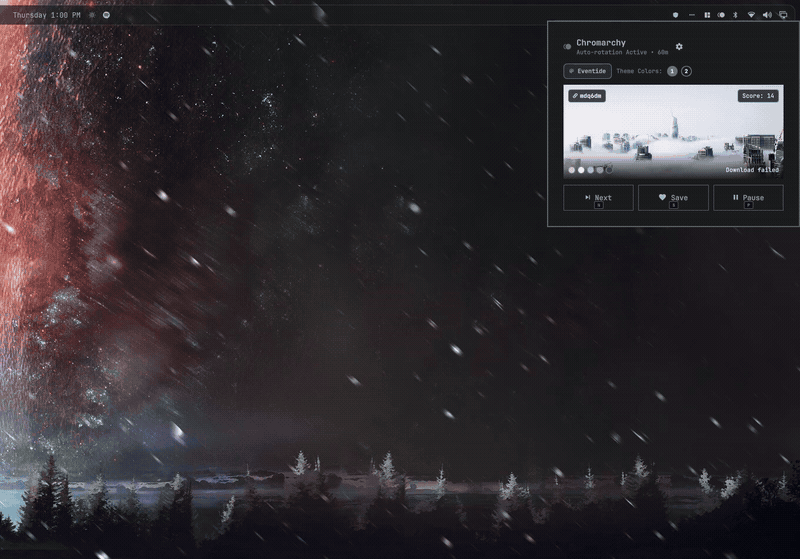

# Chromarchy

Theme-aware Wallhaven wallpaper rotator for Omarchy.

Chromarchy matches wallpapers from Wallhaven to your active Omarchy color palette using Delta-E distance calculation, and rotates them automatically.



## Features

- **Palette Matching:** Reads active theme tokens from `~/.local/state/omarchy/current/theme/colors.toml` and scores wallpapers using CIE76 Delta-E distance.
- **Score Thresholds:** Set an acceptable match tolerance (off, <= 15, <= 25, <= 35, <= 50). Automatically searches deeper pages when strict thresholds filter out initial results.
- **Color Modes:** Matching (active theme colors), Complementary (180-degree color wheel opposite), or Surprise (alternating per rotation).
- **Ranked Palette:** Pick and rank which theme colors drive the API search query vs local scoring.
- **Pre-fetching:** Downloads and scales wallpapers in the background so transitions are instant.
- **Multi-Monitor:** Support for synchronized wallpapers across all screens or distinct wallpapers per display.
- **Keyboard Shortcuts:** In-panel keybinds to cycle, save, pause, and view source links.

## Requirements

- Omarchy
- `python3` and `curl`
- `imagemagick` (recommended, for display scaling)

## Installation

Install using the Omarchy CLI:

```bash
omarchy plugin add https://github.com/rendarth/chromarchy.git --enable
```

Or add the widget to `~/.config/omarchy/shell.json`:

```json
{
  "bar": {
    "sections": {
      "right": [
        {
          "id": "io.rendarth.chromarchy"
        }
      ]
    }
  }
}
```

Reload the shell to activate:

```bash
omarchy restart shell
```

## Removal

To remove the plugin:

```bash
omarchy plugin remove io.rendarth.chromarchy
omarchy restart shell
```

## Bar Placement

To place Chromarchy in a different section of the bar:

```bash
omarchy bar move io.rendarth.chromarchy --section left
omarchy bar move io.rendarth.chromarchy --section center
omarchy bar move io.rendarth.chromarchy --section right
```

You can also change placement from the in-panel settings view.

## Controls

### Bar Widget
- **Left click:** Open or close panel
- **Middle click:** Skip to next wallpaper
- **Right click:** Save current wallpaper

### Popup Panel
- `n`: Next wallpaper
- `s`: Save wallpaper
- `p`: Pause / resume rotation
- `r`: Force new fetch
- `o`: Open wallpaper on Wallhaven in default browser
- `Esc`: Close panel

## Configuration

Settings can be changed from the panel settings gear or defined in `~/.config/omarchy/shell.json`:

| Key | Type | Default | Description |
| :--- | :--- | :--- | :--- |
| `colorMode` | string | `"matching"` | `"matching"`, `"complementary"`, or `"surprise"` |
| `colorKeys` | array | `["accent", "background"]` | Ranked theme color keys for search and scoring |
| `maxScore` | number | `0` | Max Delta-E score threshold (`0` for off, `15`, `25`, `35`, `50`) |
| `keywords` | string | `""` | Search keywords (e.g. `minimal`, `space`, `nature`) |
| `category` | string | `"general"` | Wallhaven category (`general`, `anime`, `people`, `all`) |
| `purity` | string | `"sfw"` | Content filter (`sfw`, `sketchy`, `all`) |
| `fetchMode` | string | `"prefetch"` | `"prefetch"` (background batch) or `"live"` |
| `prefetchCount` | number | `10` | Number of wallpapers to pre-fetch |
| `interval` | number | `1800` | Rotation interval in seconds |
| `multiMonitor` | string | `"same"` | `"same"` or `"different"` per display |
| `saveBehavior` | string | `"rotate"` | `"rotate"` (adds to `backgrounds/`) or `"save-only"` |
| `allowDuplicates` | boolean | `false` | Allow repeating wallpapers in history |

## CLI & Keybindings

Control Chromarchy externally via shell IPC:

```bash
# Next wallpaper
omarchy-shell -q io.rendarth.chromarchy next

# Previous wallpaper
omarchy-shell -q io.rendarth.chromarchy prev

# Save current wallpaper
omarchy-shell -q io.rendarth.chromarchy save

# Toggle panel
omarchy-shell -q io.rendarth.chromarchy toggle
```

### Hyprland Bindings (`~/.config/hypr/hyprland.conf`)

```ini
bind = SUPER ALT, W, exec, omarchy-shell -q io.rendarth.chromarchy next
bind = SUPER ALT, S, exec, omarchy-shell -q io.rendarth.chromarchy save
```

## Testing

Run the automated backend test suite:

```bash
~/.config/omarchy/plugins/io.rendarth.chromarchy/scripts/test_backend.sh
```

## License

MIT
