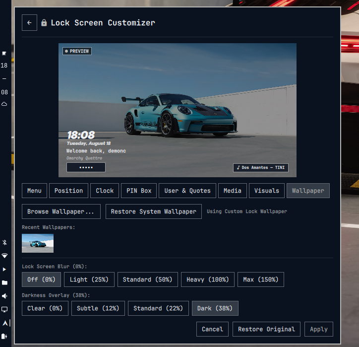

# Omarchy Lock Style

**Lock Style** is a customization engine and bar widget for the [Omarchy](https://github.com/basecamp/omarchy) lock screen based on [Quickshell](https://quickshell.org/). It provides an interactive real-time preview, deep visual customization (`LockView`), automatic backup of the stock lock screen, custom lock wallpapers with blur control, and one-click factory restoration.

<p align="center">
  
</p>

---

## ✨ Key Features

### 1. Automatic Backup & Safe Restoration

- **Initial Backup**: On first run, it secures an untouched copy of the stock `LockView.qml` in `~/.config/omarchy/lock-style/backup/LockView.original.qml`.
- **1-Click Factory Restore**: Revert to the original Omarchy lock screen design at any time using the _Restore Original_ button.

### 2. PIN & Password Box Customization

- **Display Modes**:
  - `Dots (●)`: Classic sleek masked input.
  - `Asterisks (*)`: Classic UNIX terminal style.
  - `Dashes (—)`: Modern minimalist aesthetic.
  - `Stealth (Blank)`: No visual feedback for maximum privacy.
- **Dynamic Width Slider**: Adjust width smoothly from `180px` up to a maximum default of `380px` with proportional height and font scaling.
- **Corner Radius**: Choose from Square (`4px`), Rounded (`14px`), Medium (`20px`), or Pill / Capsule (`32px`).
- **Opacity & Focus Glow**: Adjustable background opacity and breathing focus animation.

### 3. Fully Configurable Clock & Date

- **12-Hour Format Switch**: Toggle between 24-hour format (`14:30`) by default and 12-hour format with AM/PM indicator (`02:30 PM`).
- **Vertical Stacked Layout Switch**: Toggle between horizontal (`HH:MM`) by default and vertically stacked (hours above minutes).
- **Positioning**: Place clock & date above or below the PIN box.
- **System Fonts Dropdown**: Detects and previews all system-installed fonts directly from a searchable, upward-opening dropdown menu.
- **Independent Date Control**: Display date above or below clock (or standalone even if clock is disabled) with Full (`Tuesday, August 18`), Compact (`Tue, 18 Aug`), or ISO (`YYYY-MM-DD`) formats.

### 4. User Profile & Motivational Developer Quotes

- **Avatar Circle**: Displays user avatar (`~/.face` / `~/.face.icon`) with an accent border or stylized glyph icon.
- **Welcome Greeting**: Configurable greeting banner (`Welcome back, {user}`).
- **Motivational Quotes & Custom Text**:
  - **Quotes Enabled**: Displays randomized developer humor, hacker quotes, and motivational phrases on every wake.
  - **Quotes Disabled**: Unlocks an optional custom message field to display your own custom quote or leave empty for a clean look.

### 5. Custom Lock Screen Wallpaper & Blur Engine

- **Independent Lock Wallpaper**: Choose a dedicated lock screen wallpaper separate from your desktop background.
- **Native File Picker**: Select images via native system file browser with automatic local copying to `~/.config/omarchy/lock-style/wallpapers/`.
- **Recent Wallpapers Gallery**: Visual thumbnail history with one-click re-apply and individual delete (`✕`) badges.
- **Blur & Dimming Presets**: Fine-tune background blur (0% to 150%) and darkness overlay (0% to 38%).
- **Restore System Wallpaper**: Revert instantly to your active desktop background.

### 6. MPRIS Media Player Widget

- When music or podcasts are playing (Spotify, Firefox, Brave, Amberol, MPV, etc.), an elegant media card automatically appears on the lock screen showing the track title, artist, and musical glyph `󰎈`.
- Perfectly aligned with uniform lateral margins across all corner positions.

### 7. Interactive Real-Time Preview

- Embedded 16:9 viewport simulating changes in real time for layout, typography, colors, wallpaper, blur, quotes, and password masking.

### 8. Menu & Bar Icon Visibility

- **Power Menu Integration**: Quick access to lock, restart, sleep, shutdown, and settings.
- **Hide Bar Icon Option**: Option to hide the bar widget button entirely for a clean bar layout, with IPC support to open Lock Style via hotkey or `omarchy-shell shell toggle omarchy-lock-style`.
- **Custom Bar Icons & Presets**: Choose from Nerd Font glyphs (`󰌾`, `🔒`, `󰐥`, `󰣇`, `⚡`, `🐧`, etc.) or paste custom text.

### 9. Built-in Style Presets

- **Modern Elegance**: Vertical stacked 12h clock, date above, avatar circle, and developer quote.
- **Cyberpunk Terminal**: 24h monospace clock, asterisk password masking, sharp 4px corners, and hacker quotes.
- **Minimalist Focus**: Clean horizontal clock, pill box, distraction-free.
- **Retro Terminal**: Dashes PIN box masking, monospace typography, and terminal aesthetic.
- **Stock Omarchy**: Reverts configuration to default factory layout.

---

## 🚀 Installation

### Method 1:

```bash
omarchy plugin add https://github.com/MrDemonc/Omarchy-lock-style --enable
```

### Method 2:

```bash
git clone https://github.com/MrDemonc/Omarchy-lock-style.git
cd Omarchy-lock-style
./install.sh --enable --restart
```

---

## 🛠️ Plugin Structure & File Locations

```
lock-style/
├── manifest.json         # Plugin manifest and metadata for Omarchy
├── LockStyle.qml         # Bar widget and customization control panel
├── Service.qml           # Lock screen session service
├── LockView.qml          # Active customizable LockView component
├── LockStyleHelper.js    # Helper functions, presets, formatters, and quote pool
├── LockViewGenerator.js  # Generator engine producing customized LockView.qml
├── install.sh            # Automated installer, backup, and enable script
├── uninstall.sh          # Complete uninstaller and factory restore script
├── README.md             # Documentation
└── LICENSE               # MIT License
```

### 📂 Location of Backups and Saved Data:

| Item                                       | System Path                                                 |
| ------------------------------------------ | ----------------------------------------------------------- |
| **Installed Plugin Directory**             | `~/.config/omarchy/plugins/omarchy-lock-style/`             |
| **Active Generated Lock View**             | `~/.config/omarchy/plugins/omarchy-lock-style/LockView.qml` |
| **Original Stock Backup (`LockView.qml`)** | `~/.config/omarchy/lock-style/backup/LockView.original.qml` |
| **Copied Lock Wallpapers**                 | `~/.config/omarchy/lock-style/wallpapers/`                  |
| **Persistent Configuration (JSON)**        | `~/.config/omarchy/lock-style.json`                         |

---

## 🗑️ Uninstallation & Complete Removal

### Method 1: Omarchy Official

```bash
omarchy plugin remove omarchy-lock-style
```

### Method 2: From repo

Restores the original stock Omarchy lock screen, deletes all copied wallpapers, clears configurations, and removes the plugin:

```bash
./uninstall.sh
# or alternatively:
./install.sh --uninstall
```

---

## ⌨️ CLI Control & Keyboard Shortcuts

You can toggle or control the Lock Style panel directly from your terminal or bind it to a custom hotkey in your window manager (e.g., Hyprland, Sway):

```bash
omarchy-shell shell toggle omarchy-lock-style
```

---
