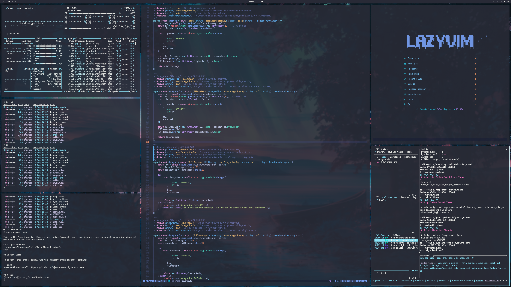

# Aura

A pastel dark theme for [Omarchy Quattro](https://github.com/omacom/omarchy).



## Install

```bash
omarchy theme install https://github.com/bjarneo/omarchy-aura-theme
```

## Optional Neovim Theme

`neovim.lua` configures Tokyo Night Moon for manual use. Omarchy does not install Lua from third-party themes.
