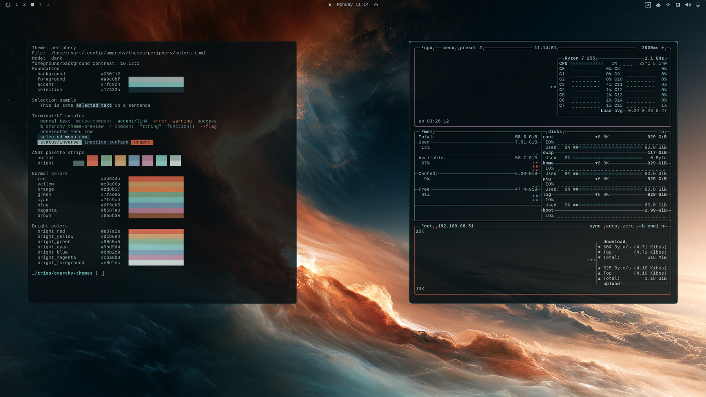

# Periphery

Cold governs; amber only warns.



The same two axes with the roles swapped. Cyan takes the accent, so the desktop
reads calm, and amber is demoted to warning and error, so the things that are
wrong read hot. The quietest theme of the set, and the one built for long
sessions.

It is also the only one that spends its accent on a cold colour. Every other
theme here puts the warm hue in front. Pick this one if you want the desktop to
stop asking for attention.

## Install

```bash
omarchy theme install https://github.com/r-bart/omarchy-periphery-theme.git
omarchy theme set periphery
```

Or use *Install > Style > Theme* in the Omarchy menu, then pick **Periphery** under
*Style > Theme* (`Super + Ctrl + Shift + Space`).

Requires Omarchy 4. The palette uses the semantic key set, which does not exist
in 2.x.

## Palette

| Key | Value |
|-----|-------|
| `accent` | `#7fc9c4` |
| `background` | `#060f12` |
| `lighter_background` | `#0f2129` |
| `foreground` | `#a9c0bf` |
| `bright_foreground` | `#e0efec` |
| `selection` | `#17333a` |
| `muted` | `#5c7876` |

Window borders come from `hyprland_active_border`, which Hyprland and every
shell card share. [`palette-check.png`](palette-check.png) renders the whole
palette into a simulated bar, terminal, menu and notification, if you want to
judge the colour relationships without installing anything.

### Contrast

WCAG relative luminance, against both surfaces a theme renders text on.
`lighter_background` is where tooltips, floats, status lines and Neovim's
`NormalFloat` sit — the surface most palettes forget to check.

| | on `background` | on `lighter_background` |
|---|---|---|
| `foreground` | 10.12 | 8.65 |
| `bright_foreground` | 16.34 | 13.96 |
| `accent` | 10.19 | 8.70 |
| `green` | 7.69 | 6.57 |
| `cyan` | 10.19 | 8.70 |
| `blue` | 6.54 | 5.59 |
| `magenta` | 6.40 | 5.46 |
| `red` | 5.27 | 4.51 |
| `muted` | 4.06 | 3.47 |

Every chromatic clears 4.5:1 on both. Body text clears 10:1.

## What it ships

`colors.toml`, `icons.theme` and `backgrounds/`. Nothing in this repository
runs on your machine: no `neovim.lua`, no terminal config, no `vscode.json`.

Half a choice. Those three would be dropped whatever this repository did: a
theme installed from a repo keeps only what is colour. The choice is the rest —
a theme *can* ship `shell.toml`, `btop.theme` or `helix.toml`, and Omarchy
keeps them, because `omarchy-theme-set-templates` only renders a template when
the output file does not already exist. Leaving them out is what makes the
entire desktop fall out of the palette, window borders included — and it is
also why `shell.toml` is left to Omarchy's template, so this theme keeps
picking up shell improvements on each release instead of pinning a snapshot.

No Hyprland config either, and that one is not a choice. Omarchy reads none
from a theme directory, and `omarchy theme install` drops every `.lua` a cloned
theme ships. The window metrics this design was drawn against are in
[Window metrics](#window-metrics), to paste in yourself.

## Backgrounds

Five, cycled with `Super + Ctrl + Space`. The same five ship with every theme
in this set; only the order differs. Omarchy picks the first in sort order,
unless the background you were already on shares its filename with one of
these — then it advances to the next, because `omarchy-theme-set` cycles from
the current entry.

| File | Scene |
|------|-------|
| `1-flow.jpg` **(default)** | Cosmic flow, warm filaments. Same caveat as the dune. |
| `2-crescent.webp` | Crescent over a planet’s limb, orange atmosphere. The upper-left is nearly empty, so windows land on black. |
| `3-gate.jpg` | Monolith with a vertical seam of light, a crescent in the upper left. The seam is near-white and dead centre, where the menu opens. |
| `4-dune.webp` | Risograph halftone dune. High contrast centre-left; best at full window opacity. |
| `5-arch.jpg` | A lit concrete shell on a frozen shore under a vast crescent planet. Everything bright sits in the lower third; the sky above is flat, so windows land clean. |

Two formats, and the reason is weight. Everyone who installs the theme clones
`backgrounds/` in full, and a wallpaper is decoded to the same framebuffer
whatever it weighs. The two heaviest scenes are WebP and fall from 5.43 MB to
2.39 MB together. The other three are already under 2.2 MB and stay JPEG.

WebP is safe on Omarchy 4, and it was not always. `qt6-imageformats` — the Qt
decoder Quickshell needs — reached the base package list on 19 August 2026,
through the `Add webp decoding to the shell` migration. 79 of the 92
backgrounds Omarchy itself ships are now `.webp`, and `omarchy-theme-set` lists
`.webp` among the extensions it accepts. On an install that predates the
migration and has never updated, a WebP wallpaper fails at
`Error decoding: ... Unsupported image format` and leaves a black desktop.
Updating Omarchy is the fix.

All five are 2912×1632. The JPEGs are quality 95, baseline, with no chroma
subsampling. Full chroma matters here. Every scene sets a saturated warm edge
against a cold field, and 4:2:0 softens that edge. macOS `sips` writes 4:4:4
only at quality 100, which triples the file for no visible gain. These were
built with `cjpeg -quality 95 -sample 1x1 -optimize`. The WebPs were re-encoded
from them, capped at 4K wide, with
`magick input.jpg -strip -resize '3840>' -quality 82 output.webp`.

Add your own in `~/.config/omarchy/backgrounds/periphery/` — they appear alongside
these.

## Window metrics

Not part of the theme. Omarchy never reads a Hyprland config from a theme
directory; the only thing a theme sends the compositor is
`hyprland_active_border`. To match the design, paste the block below into
`~/.config/hypr/looknfeel.lua`, which is loaded after both Omarchy's defaults
and the active theme, so it wins over both.

This repository ships no `.lua` of its own, and none would survive if it did.
`omarchy theme install` stages only what is colour and drops every `.lua` a
cloned theme ships — a theme's Lua is code the compositor would run at login,
and installing someone's theme should change what your desktop looks like,
never what it runs. The block below is the whole of it, so this README stands
on its own.

```lua
hl.config({
  decoration = {
    rounding_power = 4,

    -- The 0.05 gap is what marks the focused window.
    active_opacity = 0.90,
    inactive_opacity = 0.85,

    -- Translucency without blur makes text unreadable over these wallpapers.
    blur = {
      enabled = true,
      size = 6,
      passes = 2,
    },

    shadow = {
      enabled = true,
      range = 20,
      render_power = 4,
      color = "rgba(060f1299)",
      color_inactive = "rgba(060f1266)",
    },
  },
})
```

Omarchy 4 configures Hyprland in **Lua**, not `.conf`, and there is no
`~/.config/hypr/hyprland.conf`. Corner rounding is a machine-level setting that
each person picks for themselves in `~/.config/hypr/looknfeel.lua`, not
something a theme has any say in. Omarchy ships `0`; this palette is agnostic
either way.

Worth knowing if you change it: the shell mirrors Hyprland's
`decoration:rounding` into its own card corners, so rounding your windows also
rounds the menu, launcher, notifications and tooltips. And it only re-reads
that value on startup, on a theme change, and on the
`omarchy toggle window-gaps` flag — a hand-edited `looknfeel.lua` plus
`hyprctl reload` rounds the windows while the shell keeps the old radius until
you re-apply a theme or restart it.

## The rest of the set

Same five wallpapers, different palette over them.

| Theme | |
|-------|--|
| [Terminus](https://github.com/r-bart/omarchy-terminus-theme) | Navy ground, gold accent. |
| [Vault](https://github.com/r-bart/omarchy-vault-theme) | Warm sepia ground, orange accent. |
| [Starsend](https://github.com/r-bart/omarchy-starsend-theme) | Near-black ground, one amber signal. |

## License

MIT. See [LICENSE](LICENSE).
